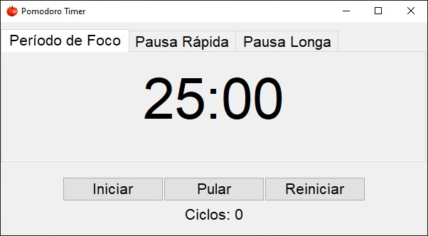

<h1>Timer de Pomodoro em Python</h1>

Projeto em Python criado para aumentar a produtividade e melhorar a gestão do tempo. Baseado na técnica Pomodoro, esse aplicativo permite que os usuários dividam seu trabalho em intervalos de tempo de foco intenso, seguidos por pausas curtas e pausas longas, tudo com o conforto de uma interface simples e amigável construída com a biblioteca tkinter.

O método Pomodoro é a ferramenta perfeita para quem busca melhorar a produtividade, manter o foco nas tarefas e evitar o esgotamento. Use-o para maximizar seu tempo de trabalho e alcançar seus objetivos com eficiência.

Este projeto foi desenvolvido com o propósito de aprendizado e aprimoramento das habilidades de programação em Python e interface gráfica com tkinter.

<h3>Principais Recursos:</h3>
<ul>
    <li><strong>Tempo de Foco:</strong> Configure o tempo de foco de acordo com sua preferência, geralmente entre 25 a 30 minutos. Durante esse período, você se concentra intensamente em sua tarefa.</li>
    <li><strong>Pausa Rápida:</strong> Após cada intervalo de foco, desfrute de uma pausa curta para relaxar e recarregar por alguns minutos, normalmente entre 5 a 10 minutos.</li>
    <li><strong>Pausa Longa:</strong> Após um número específico de ciclos de foco (geralmente quatro), o aplicativo oferece uma pausa mais longa, ideal para esticar as pernas, tomar um lanche ou fazer uma pausa mais substancial.</li>
    <li><strong>Notificações e Alertas:</strong> Receba notificações sonoras para lembrá-lo quando é hora de iniciar um novo ciclo de foco ou uma pausa.</li>
    <li><strong>Acompanhamento do Progresso:</strong> Acompanhe o número de ciclos de foco completados e o tempo restante no ciclo atual para manter o controle de seu progresso.</li>
    <li><strong>Interface Gráfica em Tkinter:</strong> A interface do aplicativo é construída usando a biblioteca tkinter, proporcionando uma experiência de usuário intuitiva e agradável.</li>
</ul>
